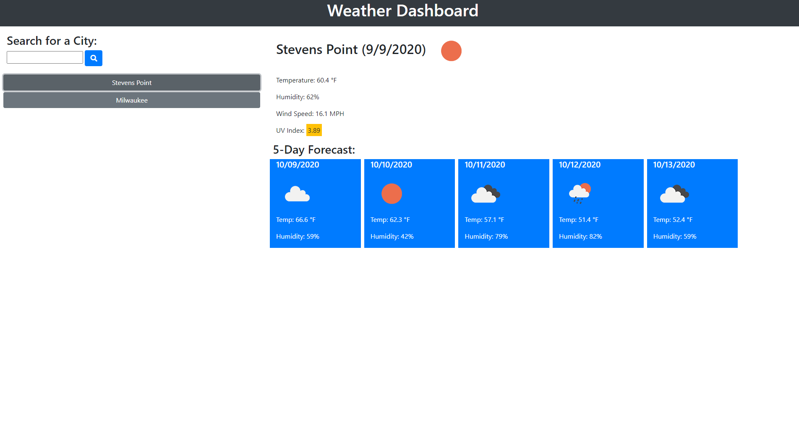

# weather-dashboard

## Description

### Purpose
This site was created to help the user see the weather for a city they searched.  When city is searched the current temperature, humidity, UV index, and weather icon show in the current weather section.  The 5-day forecast also shows when the city is searched.  That includes the weather icon, temperature, and humidity that corresponds to the future date.  The city that is searched for is also logged in localstorage and presented as a button that will bring up the current weather and forecast.
View webpage at ()

### Built With
* HTML
* JavaScript

### APIs Used
* Bootstrap
* OpenWeather